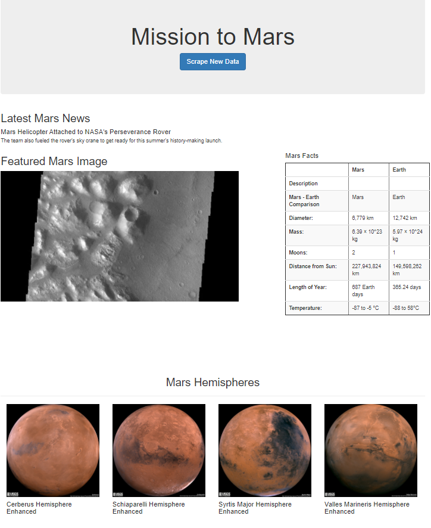

# Mission-to-Mars

## Project Overview  
Gather latest Mars data from websites using BeautifulSoup and Splinter to scrape data onto a Mongo database to be displayed on a web application called Mission to Mars.  

## Websites to scrape  
-https://data-class-mars.s3.amazonaws.com/Mars/index.html  
-https://data-class-jpl-space.s3.amazonaws.com/JPL_Space/index.html  
-https://data-class-mars-hemispheres.s3.amazonaws.com/Mars_Hemispheres/index.html  

## Summary  
The data gathered from the various sites concluded with latest Mars news, a featured Mars image, Mars facts, and images of Mars hemispheres. A web application was created to scrape for new data and display it on the app. The use of Beautiful Soup, Splinter, MongoDB, and Flask was incorporated to create functions for each subject of data. Mission to Mars will serve as a tool to research the most current information without visiting each individual site.  

  